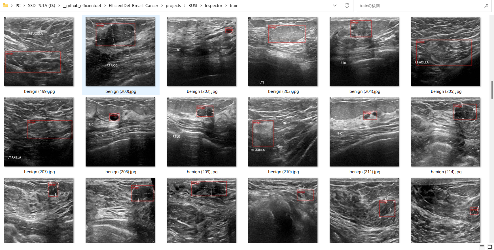
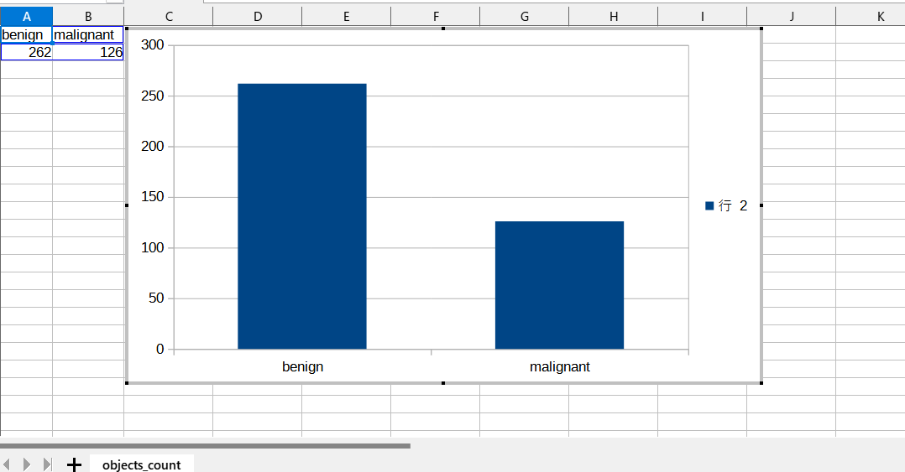

<h2>
EfficientDet-Breast-Cancer (Updated: 2023/04/10)
</h2>
This is an experimental project to detect <b>Breast Cancer</b> based on 
Breast Ultrasound Images Dataset (BUSI), by using Google Brain AutoML
<a href="https://github.com/google/automl/tree/master/efficientdet"> EfficientDet.</a> 
The original dataset used here has been take from the followin web site: 
<b>Breast Ultrasound Images Dataset</b> 
Breast ultrasound images for classification, detection & segmentation 

<pre>
https://www.kaggle.com/datasets/aryashah2k/breast-ultrasound-images-dataset
</pre>
Citation: 
<pre>
Al-Dhabyani W, Gomaa M, Khaled H, Fahmy A. 
Dataset of breast ultrasound images. Data in Brief. 
2020 Feb;28:104863. 
DOI: 10.1016/j.dib.2019.104863.
</pre>

<h2>
1. Installing tensorflow on Windows11
</h2>
We use Python 3.8.10 to run tensoflow 2.8.0 on Windows11. 
<h3>1.1 Install Microsoft Visual Studio Community</h3>
Please install <a href="https://visualstudio.microsoft.com/ja/vs/community/">Microsoft Visual Studio Community</a>, 
which can be ITed to compile source code of 
<a href="https://github.com/cocodataset/cocoapi">cocoapi</a> for PythonAPI. 
<h3>1.2 Create a python virtualenv </h3>
Please run the following command to create a python virtualenv of name <b>py38-efficientdet</b>.
<pre>
>cd c:\
>python38\python.exe -m venv py38-efficientdet
>cd c:\py38-efficientdet
>./scripts/activate
</pre>
<h3>1.3 Create a working folder </h3>
Please create a working folder "c:\google" for your repository, and install the python packages. 

<pre>
>mkdir c:\google
>cd    c:\google
>pip install cython
>git clone https://github.com/cocodataset/cocoapi
>cd cocoapi/PythonAPI
</pre>
You have to modify extra_compiler_args in setup.py in the following way:
<pre>
   extra_compile_args=[]
</pre>
<pre>
>python setup.py build_ext install
</pre>

 
<h2>
2. Installing EfficientDet-Breast-Cancer
</h2>
<h3>2.1 Clone repository</h3>
Please clone EfficientDet-Breast-Cancer.git in the working folder <b>c:\google</b>. 
<pre>
>git clone https://github.com/sarah-antillia/EfficientDet-Breast-Cancer.git 
</pre>
You can see the following folder <b>projects</b> in EfficientDet-Breast-Cancer of the working folder. 

<pre>
EfficientDet-Breast-Cancer
└─projects
      └─BUSI
          ├─eval
          ├─saved_model
          ├─test
          ├─test_outputs
          ├─train
          └─valid
</pre>
<h3>2.2 Install python packages</h3>

Please run the following command to install python packages for this project. 
<pre>
>cd ./EfficientDet-BUSI
>pip install -r requirements.txt
</pre>

 
<h3>2.3 Create TFRecord dataset</h3>
<h3>
1. Create YOLO annotation
</h3>
 We have created BUSI <b>YOLO</b> annotation dataset from the original <b>Dataset_BUSI_with_GT</b> by using the following 
 two Python scripts. 
<a href="./projects/BUSI/create_master.py">create_master</a> 
<a href="./projects/BUSI/create_yolo_annotation.py">create_yolo_annotation.py</a> 
<pre>
./YOLO/
├─test/
├─train/
└─valid/
</pre>

<h3>
2. Convert YOLO to TFRecord
</h3>
 We have created <b>TFRecord</b> dataset from BUSI <b>YOLO</b> tran and valid dataset by using 
 <a href="https://github.com/sarah-antillia/AnnotationConverters/blob/main/YOLO2TFRecordConverter.py"> YOLO2TFRecordConverter.py </a>.
Futhermore, we have also created <b>COCO</b> dataset from <b>YOLO</b> test dataset by using
 <a href="https://github.com/sarah-antillia/AnnotationConverters/blob/main/YOLO2COCOConverter.py">YOLO2COCOConvert.py</a>
 

<h3>2.4 Workarounds for Windows</h3>
As you know or may not know, the efficientdet scripts of training a model and creating a saved_model do not 
run well on Windows environment in case of tensorflow 2.8.0 (probably after the version 2.5.0) as shown below:. 
<pre>
INFO:tensorflow:Saving checkpoints for 0 into ./models\model.ckpt.
I0609 06:22:50.961521  3404 basic_session_run_hooks.py:634] Saving checkpoints for 0 into ./models\model.ckpt.
2022-06-09 06:22:52.780440: W tensorflow/core/framework/op_kernel.cc:1745] OP_REQUIRES failed at save_restore_v2_ops.cc:110 :
 NOT_FOUND: Failed to create a NewWriteableFile: ./models\model.ckpt-0_temp\part-00000-of-00001.data-00000-of-00001.tempstate8184773265919876648 :
</pre>

The real problem seems to happen in the original <b> save_restore_v2_ops.cc</b>. The simple workarounds to the issues are 
to modify the following tensorflow/python scripts in your virutalenv folder. 
<pre>
c:\py38-efficientdet\Lib\site-packages\tensorflow\python\training
 +- basic_session_run_hooks.py
 
634    logging.info("Saving checkpoints for %d into %s.", step, self._save_path)
635    ### workaround date="2022/06/18" os="Windows"
636    import platform
637    if platform.system() == "Windows":
638      self._save_path = self._save_path.replace("/", "\\")
639    #### workaround
</pre>

<pre>
c:\py38-efficientdet\Lib\site-packages\tensorflow\python\saved_model
 +- builder_impl.py

595    variables_path = saved_model_utils.get_variables_path(self._export_dir)
596    ### workaround date="2022/06/18" os="Windows" 
597    import platform
598    if platform.system() == "Windows":
599      variables_path = variables_path.replace("/", "\\")
600    ### workaround
</pre>
 
<h3>3. Inspect tfrecord</h3>
  Move to ./projects/IT_RoadSigns directory, and run the following bat file: 
<pre>
tfrecord_inspect.bat
</pre>
, which is the following:
<pre>
python ../../TFRecordInspector.py ^
  ./train/*.tfrecord ^
  ./label_map.pbtxt ^
  ./Inspector/train
</pre>
 
This will generate annotated images with bboxes and labels from the tfrecord, and cout the number of annotated objects in it. 
 
<b>TFRecordInspecotr: annotated images in train.tfrecord</b> 

 
 
<b>TFRecordInspecotr: objects_count train.tfrecord</b> 

 
This bar graph shows that the number of the objects contained in train.tfrecord.
 
 
 
<h3>4. Downloading the pretrained-model efficientdet-d0</h3>
Please download an EfficientDet model chekcpoint file <b>efficientdet-d0.tar.gz</b>, and expand it in <b>EfficientDet-Breast-Cancer</b> folder. 
 
https://storage.googleapis.com/cloud-tpu-checkpoints/efficientdet/coco2/efficientdet-d0.tar.gz
 
See: https://github.com/google/automl/tree/master/efficientdet 

<h3>5. Training Breast-Cancer Model by using the pretrained-model</h3>
Please change your current directory to <b>./projects/BUSI</b>,
and run the following bat file to train Breast-Cancer EfficientDet Model by using the train and valid tfrecords.
We have just used a parameter "autoaugment_policy=v2" in --hparams to augument the oringla images in TFRecord datase.
<pre>
1_train.bat
</pre>

<pre>
rem 1_train.bat
python ../../ModelTrainer.py ^
  --mode=train_and_eval ^
  --train_file_pattern=./train/*.tfrecord  ^
  --val_file_pattern=./valid/*.tfrecord ^
  --model_name=efficientdet-d0 ^
  --hparams="autoaugment_policy=v2,learning_rate=0.01,image_size=512x512,num_classes=2,label_map=./label_map.yaml" ^
  --model_dir=./models ^
  --label_map_pbtxt=./label_map.pbtxt ^
  --eval_dir=./eval ^
  --ckpt=../../efficientdet-d0  ^
  --train_batch_size=4 ^
  --early_stopping=map ^
  --patience=10 ^
  --eval_batch_size=4 ^
  --eval_samples=200  ^
  --num_examples_per_epoch=400 ^
  --num_epochs=100
</pre>

<table style="border: 1px solid #000;">
<tr>
<td>
--mode</td><td>train_and_eval</td>
</tr>
<tr>
<td>
--train_file_pattern</td><td>./train/*.tfrecord</td>
</tr>
<tr>
<td>
--val_file_pattern</td><td>./valid/*.tfrecord</td>
</tr>
<tr>
<td>
--model_name</td><td>efficientdet-d0</td>
</tr>
<tr><td>
--hparams</td><td>"autoaugment_policy=v2,learning_rate=0.01,image_size=512x512,num_classes=2,label_map=./label_map.yaml"
</td></tr>
<tr>
<td>
--model_dir</td><td>./models</td>
</tr>
<tr><td>
--label_map_pbtxt</td><td>./label_map.pbtxt
</td></tr>

<tr><td>
--eval_dir</td><td>./eval
</td></tr>

<tr>
<td>
--ckpt</td><td>../../efficientdet-d0</td>
</tr>
<tr>
<td>
--train_batch_size</td><td>4</td>
</tr>
<tr>
<td>
--early_stopping</td><td>map</td>
</tr>
<tr>
<td>
--patience</td><td>10</td>
</tr>

<tr>
<td>
--eval_batch_size</td><td>1</td>
</tr>
<tr>
<td>
--eval_samples</td><td>200</td>
</tr>
<tr>
<td>
--num_examples_per_epoch</td><td>400</td>
</tr>
<tr>
<td>
--num_epochs</td><td>100</td>
</tr>
</table>
 
 
<b>label_map.yaml:</b>
<pre>
1: 'benign'
2: 'malignant'
</pre>
The console output from the training process is the following, from which you can see that 
mAP [IoU=0.50:0.95] is very low. 
 
<b><a href="./projects/BUSI/eval/coco_metrics.csv">COCO metrics at epoch 87</a></b> 

 

 
<b><a href="./projects/BUSI/eval/coco_metrics.csv">COCO metrics f and map</a></b> 

 
 
<b><a href="./projects/BUSI/eval/train_losses.csv">Train losses</a></b> 

 
 

<b><a href="./projects/BUSI/eval/coco_ap_per_class.csv">COCO ap per class</a></b> 

 

<h3>
6. Create a saved_model from the checkpoint
</h3>
  Please run the following bat file to create a saved_model from the checkpoint files in <b>./models</b> folder.  
<pre>
2_create_saved_model.bat
</pre>
, which is the following:
<pre>
rem 2_create_saved_model.bat  
python ../../SavedModelCreator.py ^
  --runmode=saved_model ^
  --model_name=efficientdet-d0 ^
  --ckpt_path=./models  ^
  --hparams="image_size=512x512,num_classes=2" ^
  --saved_model_dir=./saved_model
</pre>

<table style="border: 1px solid #000;">
<tr>
<td>--runmode</td><td>saved_model</td>
</tr>

<tr>
<td>--model_name </td><td>efficientdet-d0 </td>
</tr>

<tr>
<td>--ckpt_path</td><td>./models</td>
</tr>

<tr>
<td>--hparams</td><td>"image_size=512x512,num_classes=2"</td>
</tr>

<tr>
<td>--saved_model_dir</td><td>./saved_model</td>
</tr>
</table>

 
 
<h3>
7. Inference Breast-Cancer by using the saved_model
</h3>
<h3>7.1 Inference scripts</h3>
 Please run the following bat file to infer Breast Cancer mages of test dataset:
<pre>
3_inference.bat
</pre>
, which is the following:
<pre>
rem 3_inference.bat
python ../../SavedModelInferencer.py ^
  --runmode=saved_model_infer ^
  --model_name=efficientdet-d0 ^
  --saved_model_dir=./saved_model ^
  --min_score_thresh=0.4 ^
  --hparams="num_classes=2,label_map=./label_map.yaml" ^
  --input_image=./test/*.jpg ^
  --classes_file=./classes.txt ^
  --ground_truth_json=./test/annotation.json ^
  --output_image_dir=./test_outputs
</pre>

<table style="border: 1px solid #000;">
<tr>
<td>--runmode</td><td>saved_model_infer </td>
</tr>
<tr>
<td>--model_name</td><td>efficientdet-d0 </td>
</tr>

<tr>
<td>--saved_model_dir</td><td>./saved_model </td>
</tr>

<tr>
<td>--min_score_thresh</td><td>0.4 </td>
</tr>

<tr>
<td>--hparams</td><td>"num_classes=2,label_map=./label_map.yaml"</td>
</tr>

<tr>
<td>--input_image</td><td>./test/*.jpg</td>
</tr>

<tr>
<td>--classes_file</td><td>./classes.txt</td>
</tr>

<tr>
<td>--ground_truth_json</td><td>./test/annotation.json</td>
</tr>

<tr>
<td>--output_image_dir</td><td>./test_outputs</td>
</tr>
</table>

 

 
<h3>

7.2. Some Inference results of Breast-Cancer
</h3>
 
<a href="./projects/BUSI/test_outputs//benign (1).jpg_objects.csv">benign (1).jpg_objects.csv</a> 
 

 
<a href="./projects/BUSI/test_outputs//benign (7).jpg_objects.csv">benign (7).jpg_objects.csv</a> 
 

 
<a href="./projects/BUSI/test_outputs//benign (19).jpg_objects.csv">benign (19).jpg_objects.csv</a> 
 

 
<a href="./projects/BUSI/test_outputs//benign (33).jpg_objects.csv">benign (33).jpg_objects.csv</a> 
 

 
<a href="./projects/BUSI/test_outputs//benign (54).jpg_objects.csv">benign (54).jpg_objects.csv</a> 
 

 
<a href="./projects/BUSI/test_outputs//malignant (34).jpg_objects.csv">malignant (34).jpg_objects.csv</a> 
 

 
<a href="./projects/BUSI/test_outputs//malignant (71).jpg_objects.csv">malignant (71).jpg_objects.csv</a> 
 

 
<a href="./projects/BUSI/test_outputs//malignant (128).jpg_objects.csv">malignant (1).jpg_objects.csv</a> 
 

 
<a href="./projects/BUSI/test_outputs//malignant (196).jpg_objects.csv">malignant (196).jpg_objects.csv</a> 
 

 
<a href="./projects/BUSI/test_outputs//malignant (202).jpg_objects.csv">malignant (202).jpg_objects.csv</a> 
 

<h3>7.3. COCO metrics of inference result</h3>
The 3_inference.bat computes also the COCO metrics(f, map, mar) to the <b>realistic_test_dataset</b> as shown below: 
<a href="./projects/BUSI/test_outputs/prediction_f_map_mar.csv">prediction_f_map_mar.csv</a>

 
<b><a href="./projects/BUSI/eval/coco_metrics.csv">COCO metrics at epoch 87</a></b> 

 

<h3>
References
</h3>
<b>1. Breast Ultrasound Images Dataset</b> 
Breast ultrasound images for classification, detection & segmentation 
<pre>
https://www.kaggle.com/datasets/aryashah2k/breast-ultrasound-images-dataset
</pre>
Citation: 
<pre>
Al-Dhabyani W, Gomaa M, Khaled H, Fahmy A. 
Dataset of breast ultrasound images. Data in Brief. 
2020 Feb;28:104863. 
DOI: 10.1016/j.dib.2019.104863.
</pre>

<b>2. Breast lesion detection using an anchor-free network from ultrasound images with segmentation-based enhancement</b> 
Yu Wang & Yudong Yao 
<pre>
https://www.nature.com/articles/s41598-022-18747-y
</pre>

<b>3. Classification of Breast Cancer Ultrasound Images with Deep Learning-Based Models </b> 
Fatih Uysa,and Mehmet Murat Köse 
<pre>
https://www.mdpi.com/2673-4591/31/1/8/html
</pre>

<b>4. A CNN Deep Learning Technique for Prediction of Breast Cancer using Ultrasound Image
</b> 
Atisham Khan and Silky Pareyani 
<pre>
https://www.jetir.org/papers/JETIR2303813.pdf
</pre>

